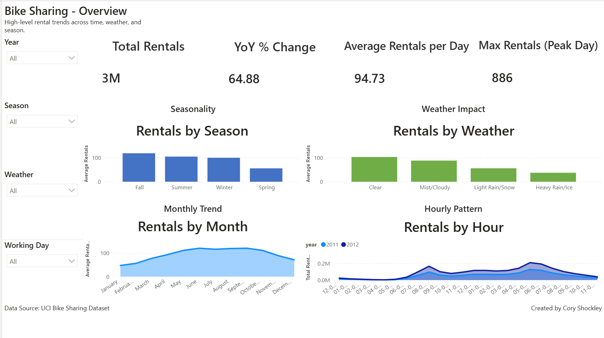
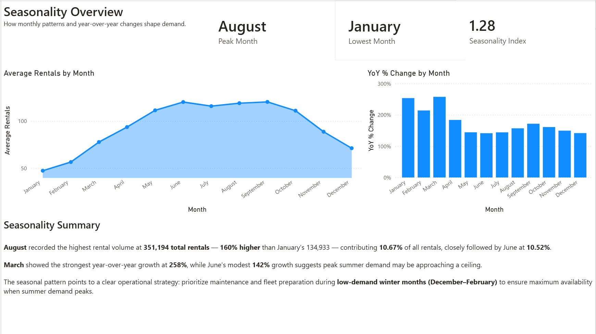
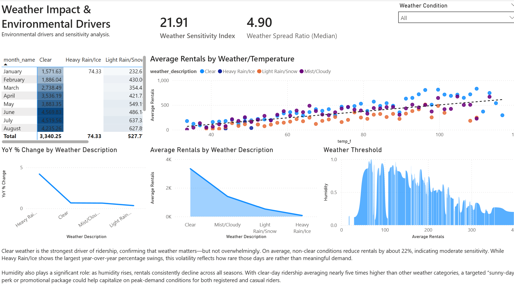
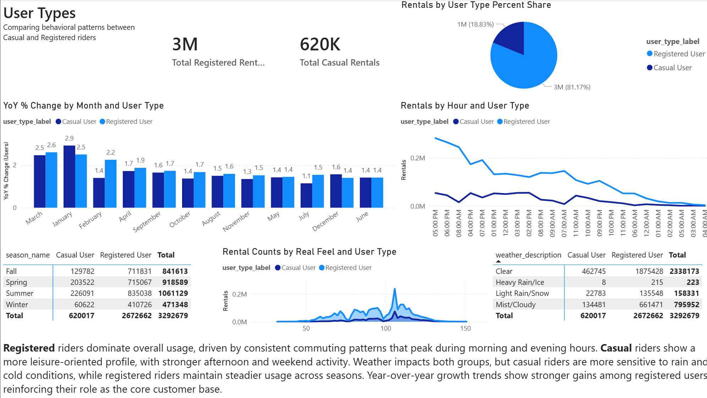
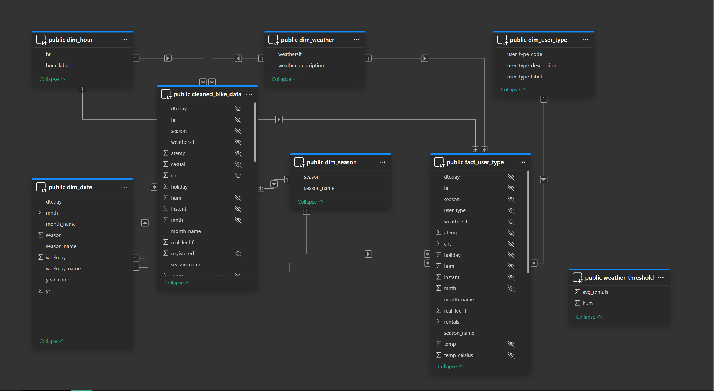

# bike-sharing-end-to-end-analysis
A complete end‑to‑end analytics workflow built from raw data to insights.
This project uses SQL for data cleaning and modeling, Python for exploratory analysis and forecasting preparation, and Power BI for a polished 5‑page interactive dashboard covering seasonality, hourly patterns, weather impact, and user segmentation.
Designed as a portfolio‑ready demonstration of modern analytics skills across the full data lifecycle.

## 📊 Power BI Dashboard

This interactive report visualizes bike‑sharing trends across seasonality, weather, and user segments.

### Overview Page

### Seasonality Analysis

### Hourly Patterns

### Weather Impact

### User Segmentation (User Type Page)

### Data Model

